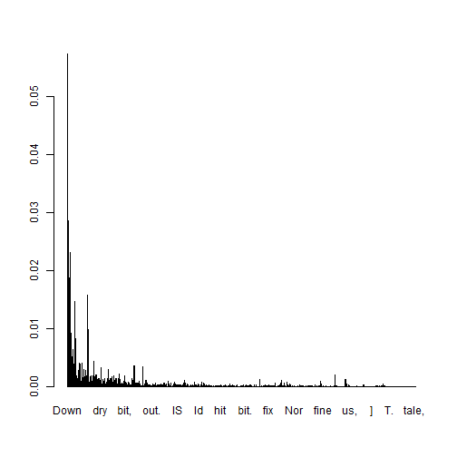
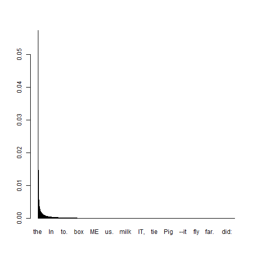

# Spin Demo


This is a demonstration of **knitr**'s `spin` function.  First Fork this repo to try it out. Then install/load **knitr**:

```r
if (!require("pacman")) install.packages("pacman"); library(pacman)
p_load(knitr)
```

Create a commented R script as normal using hashline prefixes.  Caitlin Diddams from the University at Buffalo has provided the [lesson plan.R](https://github.com/trinker/spinDemo/blob/master/lesson%20plan.R) script for this demonstration.  We simply run`spin` and a nice .md and .html file are produced.

```r
knitr::spin("lesson plan.R")
```

# The Output


```r
#Code by Caitlin Diddams for "Textual Analysis with R For Humanists," SUNY Buffalo April 18 2014
# Operations

  #Expressions
    # from command line

1+1
```

```
## [1] 2
```

```r
"hello world"
```

```
## [1] "hello world"
```

```r
(10*5)/2
```

```
## [1] 25
```

```r
  # Logical values (Boolean)

5<6
```

```
## [1] TRUE
```

```r
x=10
5+5==10
```

```
## [1] TRUE
```

```r
# Objects

x<-42

x/2
```

```
## [1] 21
```

```r
x<-"hello world"

help(sum)

?help
sum(1,2,3)
```

```
## [1] 6
```

```r
  #Vectors

c(1,2,3)
```

```
## [1] 1 2 3
```

```r
c("a", "b", "c")
```

```
## [1] "a" "b" "c"
```

```r
sentence<-c("hello", "world")

sentence[2]
```

```
## [1] "world"
```

```r
sentence[3]<-"!"

a<-c(1,2,NA,3)

sum(a)
```

```
## [1] NA
```

```r
sum(a, na.rm = TRUE)
```

```
## [1] 6
```

```r
  #Functions

f<-function(x,y){x+y}
f(2,3)
```

```
## [1] 5
```

```r
f<-function(x, y) {
  z1 <- 2*x + y
  z2 <- x + 2*y
  z3 <- 2*x + 2*y
  z4 <- x/y
  return(c(z1, z2, z3, z4))
}

    #scan
cat <- scan("carroll_alice.txt", what = "character")
head(cat)
```

```
## [1] "Down"        "the"         "Rabbit-Hole" "Alice"       "was"        
## [6] "beginning"
```

```r
#cat<-scan("catullus_adcornelium.txt", what = "character", sep = "")

    #length
length(cat)
```

```
## [1] 26409
```

```r
    #which
which(cat=="alice")
```

```
## integer(0)
```

```r
which(cat=="the")
```

```
##    [1]     2    17    32    50    75    86    95   102   134   138   171
##   [12]   180   236   255   270   318   377   380   411   435   450   496
##   [23]   499   510   536   539   568   605   649   659   688   699   702
##   [34]   728   788   816   925   949   986  1008  1041  1044  1071  1078
##   [45]  1091  1098  1107  1153  1156  1161  1167  1185  1213  1218  1229
##   [56]  1252  1255  1293  1371  1379  1423  1426  1433  1454  1511  1671
##   [67]  1677  1683  1747  1755  1784  1797  1804  1814  1833  1845  1848
##   [78]  1864  1997  2012  2037  2050  2058  2085  2107  2127  2150  2163
##   [89]  2181  2196  2268  2286  2321  2339  2366  2369  2387  2395  2417
##  [100]  2476  2499  2512  2527  2548  2565  2567  2595  2616  2621  2627
##  [111]  2638  2644  2654  2682  2689  2711  2713  2719  2725  2734  2741
##  [122]  2823  2859  2869  2876  2900  2929  2934  2943  2952  2955  2986
##  [133]  3156  3186  3220  3225  3255  3270  3280  3285  3292  3299  3311
##  [144]  3365  3385  3395  3404  3415  3421  3447  3518  3616  3637  3711
##  [155]  3742  3757  3780  3795  3868  3877  3913  3942  3949  3976  3990
##  [166]  4088  4105  4124  4156  4190  4217  4224  4252  4255  4260  4277
##  [177]  4283  4351  4385  4402  4442  4445  4475  4487  4499  4506  4513
##  [188]  4532  4540  4550  4562  4570  4577  4589  4600  4604  4629  4643
##  [199]  4671  4680  4723  4733  4737  4747  4752  4769  4781  4793  4801
##  [210]  4826  4850  4852  4869  4880  4895  4905  4910  4945  4965  4989
##  [221]  5014  5023  5028  5035  5051  5064  5073  5114  5145  5149  5179
##  [232]  5190  5194  5218  5251  5265  5274  5285  5295  5313  5361  5381
##  [243]  5399  5408  5423  5454  5457  5486  5499  5521  5530  5564  5567
##  [254]  5613  5623  5642  5658  5685  5695  5733  5736  5775  5796  5800
##  [265]  5822  5890  5894  5939  5949  5972  6040  6043  6073  6076  6080
##  [276]  6084  6092  6148  6157  6213  6223  6245  6254  6260  6292  6321
##  [287]  6339  6366  6390  6396  6404  6417  6426  6504  6512  6529  6550
##  [298]  6582  6597  6606  6609  6632  6638  6660  6696  6777  6897  6926
##  [309]  6942  6948  6961  6976  6988  6993  7002  7033  7048  7052  7065
##  [320]  7107  7142  7165  7190  7269  7306  7342  7355  7358  7370  7406
##  [331]  7432  7449  7456  7465  7513  7539  7578  7585  7666  7671  7675
##  [342]  7720  7736  7760  7772  7781  7813  7825  7873  7895  7901  7922
##  [353]  7946  7984  7995  8012  8028  8036  8052  8115  8118  8161  8164
##  [364]  8168  8184  8207  8212  8215  8221  8263  8267  8276  8295  8352
##  [375]  8359  8387  8402  8440  8457  8460  8473  8481  8492  8528  8541
##  [386]  8544  8560  8574  8602  8605  8623  8676  8700  8738  8785  8809
##  [397]  8821  8824  8832  8861  8880  8897  8921  8939  8982  9015  9027
##  [408]  9059  9072  9114  9136  9155  9160  9168  9184  9190  9203  9219
##  [419]  9222  9225  9244  9254  9265  9274  9294  9346  9358  9371  9384
##  [430]  9420  9450  9485  9520  9535  9540  9565  9568  9587  9593  9608
##  [441]  9630  9633  9657  9668  9707  9726  9731  9733  9787  9821  9955
##  [452] 10020 10029 10032 10069 10086 10113 10124 10136 10169 10180 10183
##  [463] 10190 10228 10232 10235 10264 10286 10307 10322 10328 10405 10443
##  [474] 10445 10510 10528 10542 10565 10586 10617 10678 10744 10755 10779
##  [485] 10797 10826 10881 10908 10916 10921 10930 10936 10939 10944 10949
##  [496] 10978 10992 10997 11002 11005 11011 11018 11030 11041 11045 11116
##  [507] 11127 11153 11156 11184 11210 11218 11221 11233 11248 11256 11260
##  [518] 11290 11293 11318 11321 11370 11392 11414 11416 11425 11430 11435
##  [529] 11475 11478 11485 11501 11508 11518 11563 11571 11593 11628 11660
##  [540] 11672 11699 11702 11707 11721 11724 11751 11766 11816 11823 11867
##  [551] 11873 11888 11899 11908 11911 11916 11943 11977 12008 12011 12018
##  [562] 12021 12025 12030 12037 12048 12086 12092 12109 12116 12136 12191
##  [573] 12214 12255 12289 12295 12339 12379 12382 12532 12547 12601 12615
##  [584] 12681 12727 12745 12765 12796 12812 12843 12865 12897 12913 12962
##  [595] 12969 12991 13016 13030 13033 13064 13094 13098 13113 13119 13152
##  [606] 13169 13195 13206 13209 13214 13221 13245 13267 13270 13278 13282
##  [617] 13289 13316 13356 13374 13377 13381 13397 13419 13439 13481 13486
##  [628] 13498 13519 13548 13574 13666 13671 13685 13703 13709 13715 13730
##  [639] 13746 13756 13772 13789 13800 13806 13810 13814 13839 13843 13848
##  [650] 13897 13905 13912 13917 13920 13935 13945 13951 13987 14010 14013
##  [661] 14026 14049 14061 14066 14108 14147 14150 14165 14169 14173 14178
##  [672] 14192 14216 14238 14277 14300 14310 14329 14344 14375 14392 14424
##  [683] 14430 14435 14456 14471 14479 14487 14492 14525 14529 14532 14541
##  [694] 14556 14585 14600 14614 14630 14633 14645 14655 14657 14669 14687
##  [705] 14690 14737 14751 14770 14789 14818 14844 14880 14889 14919 14940
##  [716] 14967 14978 15012 15015 15022 15034 15060 15093 15107 15122 15126
##  [727] 15131 15139 15142 15148 15156 15169 15175 15186 15202 15214 15233
##  [738] 15238 15252 15265 15280 15316 15343 15365 15410 15431 15439 15442
##  [749] 15463 15474 15477 15495 15498 15519 15557 15563 15581 15587 15592
##  [760] 15601 15624 15634 15638 15642 15653 15656 15658 15742 15754 15767
##  [771] 15795 15813 15834 15876 15902 15941 15950 15974 15987 15999 16002
##  [782] 16018 16024 16033 16053 16064 16089 16094 16131 16153 16186 16200
##  [793] 16211 16224 16278 16282 16289 16302 16308 16311 16314 16382 16415
##  [804] 16432 16440 16450 16452 16454 16464 16474 16511 16518 16525 16531
##  [815] 16537 16582 16589 16600 16608 16623 16637 16642 16667 16681 16686
##  [826] 16733 16755 16758 16770 16789 16797 16828 16850 16855 16860 16877
##  [837] 16926 16978 16986 17002 17009 17014 17028 17034 17056 17061 17069
##  [848] 17114 17141 17177 17208 17225 17242 17270 17286 17370 17377 17388
##  [859] 17392 17398 17416 17419 17438 17458 17472 17481 17504 17511 17525
##  [870] 17532 17574 17581 17587 17624 17628 17646 17654 17658 17671 17686
##  [881] 17693 17741 17743 17754 17758 17779 17784 17790 17796 17811 17819
##  [892] 17851 17873 17875 17878 17888 17910 18032 18052 18063 18067 18073
##  [903] 18086 18093 18100 18107 18110 18121 18124 18129 18151 18187 18199
##  [914] 18292 18331 18356 18392 18403 18451 18458 18461 18472 18494 18498
##  [925] 18512 18519 18522 18556 18562 18569 18577 18592 18598 18606 18627
##  [936] 18650 18669 18679 18715 18718 18810 18836 18877 18911 18919 18927
##  [947] 18934 18942 18958 18977 18992 18996 19034 19036 19057 19066 19073
##  [958] 19076 19085 19087 19101 19106 19113 19136 19153 19168 19171 19173
##  [969] 19186 19201 19218 19227 19243 19259 19267 19290 19294 19309 19321
##  [980] 19327 19336 19364 19371 19374 19378 19413 19427 19437 19444 19491
##  [991] 19495 19533 19536 19542 19566 19587 19603 19656 19688 19691 19696
## [1002] 19737 19759 19793 19816 19835 19839 19843 19869 19886 19893 19907
## [1013] 19937 19954 19971 19986 19989 20005 20008 20017 20026 20042 20048
## [1024] 20101 20133 20148 20154 20201 20209 20217 20222 20238 20261 20293
## [1035] 20297 20301 20305 20317 20322 20354 20367 20376 20386 20398 20411
## [1046] 20448 20461 20465 20489 20546 20555 20560 20574 20578 20586 20599
## [1057] 20603 20620 20625 20636 20642 20656 20662 20665 20675 20678 20690
## [1068] 20694 20702 20747 20758 20762 20766 20782 20786 20816 20819 20855
## [1079] 20858 20866 20872 20885 20898 20920 20926 20941 20949 20962 20975
## [1090] 20995 21003 21018 21031 21044 21075 21080 21083 21112 21149 21152
## [1101] 21161 21172 21176 21187 21195 21201 21208 21211 21273 21297 21307
## [1112] 21325 21358 21360 21395 21410 21420 21426 21445 21473 21508 21517
## [1123] 21560 21569 21589 21595 21608 21646 21657 21660 21667 21689 21695
## [1134] 21718 21743 21746 21783 21795 21802 21805 21850 21868 21872 21902
## [1145] 21911 21951 21959 21965 21972 21988 22000 22007 22012 22015 22060
## [1156] 22063 22083 22086 22092 22095 22100 22110 22113 22124 22128 22135
## [1167] 22151 22166 22183 22186 22194 22207 22219 22277 22283 22293 22333
## [1178] 22341 22344 22363 22368 22374 22382 22385 22397 22405 22415 22420
## [1189] 22425 22432 22464 22469 22488 22491 22506 22509 22513 22543 22551
## [1200] 22573 22603 22610 22624 22627 22636 22640 22666 22696 22730 22761
## [1211] 22772 22780 22792 22795 22811 22818 22821 22852 22897 22904 22922
## [1222] 22944 22951 22980 22983 22998 23002 23005 23009 23016 23021 23057
## [1233] 23061 23067 23080 23084 23087 23094 23105 23122 23153 23163 23171
## [1244] 23175 23188 23193 23198 23202 23205 23223 23233 23237 23243 23246
## [1255] 23251 23259 23266 23281 23291 23302 23314 23322 23333 23338 23355
## [1266] 23398 23426 23455 23478 23495 23499 23504 23512 23517 23520 23527
## [1277] 23530 23534 23537 23540 23545 23560 23580 23600 23605 23608 23613
## [1288] 23616 23621 23623 23634 23650 23660 23666 23677 23683 23690 23700
## [1299] 23703 23719 23729 23739 23744 23752 23758 23793 23798 23806 23809
## [1310] 23838 23846 23868 23871 23886 23889 23912 23920 23924 23934 23938
## [1321] 23948 23964 23971 23976 23984 23987 23991 24008 24014 24017 24024
## [1332] 24029 24032 24036 24042 24047 24063 24066 24068 24071 24082 24086
## [1343] 24093 24114 24129 24153 24165 24189 24196 24202 24209 24216 24225
## [1354] 24235 24243 24254 24261 24269 24290 24296 24303 24314 24317 24325
## [1365] 24341 24344 24351 24355 24358 24380 24408 24411 24437 24448 24457
## [1376] 24481 24492 24498 24546 24552 24557 24564 24594 24598 24617 24620
## [1387] 24629 24640 24649 24654 24668 24700 24724 24760 24809 24816 24839
## [1398] 24843 24846 24872 24889 24909 24917 24929 24939 24960 24968 24977
## [1409] 24981 25002 25008 25014 25019 25037 25049 25066 25074 25079 25110
## [1420] 25115 25126 25132 25147 25167 25169 25180 25186 25188 25235 25333
## [1431] 25340 25350 25358 25376 25428 25437 25464 25500 25530 25538 25549
## [1442] 25568 25590 25595 25598 25623 25627 25634 25667 25681 25687 25691
## [1453] 25704 25715 25720 25725 25733 25748 25755 25767 25771 25803 25809
## [1464] 25840 25846 25864 25984 26020 26029 26040 26058 26076 26084 26100
## [1475] 26111 26116 26119 26122 26133 26137 26147 26152 26163 26166 26168
## [1486] 26171 26175 26178 26182 26187 26191 26231 26234 26238 26241 26251
## [1497] 26256 26259 26262 26265 26267 26270 26274 26283 26287 26290 26293
## [1508] 26296 26300 26303 26322 26339 26372 26403
```

```r
length(which(cat=="alice"))
```

```
## [1] 0
```

```r
#unique
unicat <- unique(cat)

    #loops

#for (i in unicat) {print (i)}

words <- c()
freqs <- c()
position <- 1
x <- cat

for (i in unique(x)) {
  current.word <- which(x==i)
  frequencies <- length(current.word)/length(x)
  freqs[position]<-frequencies
  words[position]<-i
  position<-position + 1
}

# Data Frames
df <- data.frame(words, freqs, stringsAsFactors=FALSE)
head(df)
```

```
##         words        freqs
## 1        Down 3.786588e-05
## 2         the 5.732894e-02
## 3 Rabbit-Hole 3.786588e-05
## 4       Alice 8.519823e-03
## 5         was 1.245787e-02
## 6   beginning 4.165247e-04
```

```r
# Bar Plot
barplot(freqs, names=words)
```

 

```r
  #sorting results
sortedfrequencies <- order(df$freqs, decreasing = TRUE)
sorteddf <- df[sortedfrequencies,]
head(sorteddf)
```

```
##    words      freqs
## 2    the 0.05732894
## 18   and 0.02851301
## 7     to 0.02677118
## 41     a 0.02306032
## 25   she 0.01870574
## 11    of 0.01859215
```

```r
with(sorteddf, barplot(freqs, names=words))
```

 


